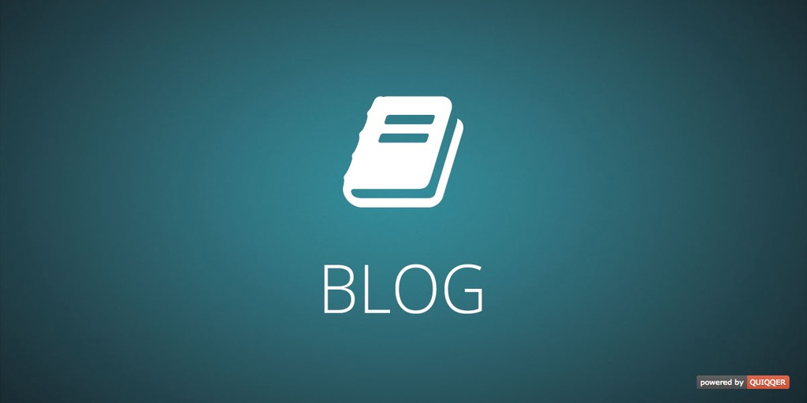

QUIQQER Blog
========

Create your own online diary. With the provided page types, managing and creating your own blog is no longer a problem.

Package name:

    quiqqer/blog

Features
--------

- Global commentary for Disqus and Facebook
- Comments can be turned off on individual pages
- Site types:
  - Blog list
  - Blog entry
- Write blog entries as guest author

In combination with the [feed module](https://dev.quiqqer.com/quiqqer/package-feed), the blog can also be offered as RSS / Atom.

You can use [QUIQQER Interview module](https://dev.quiqqer.com/quiqqer/interview) to extend blog entry with an interviewee.

Support
-------

If you have found errors, wishes or suggestions for improvement,
you can contact us by email at support@pcsg.de.

We will try to meet your needs or send them to the responsible developers
of the project.

License
-------

GPL-3.0+